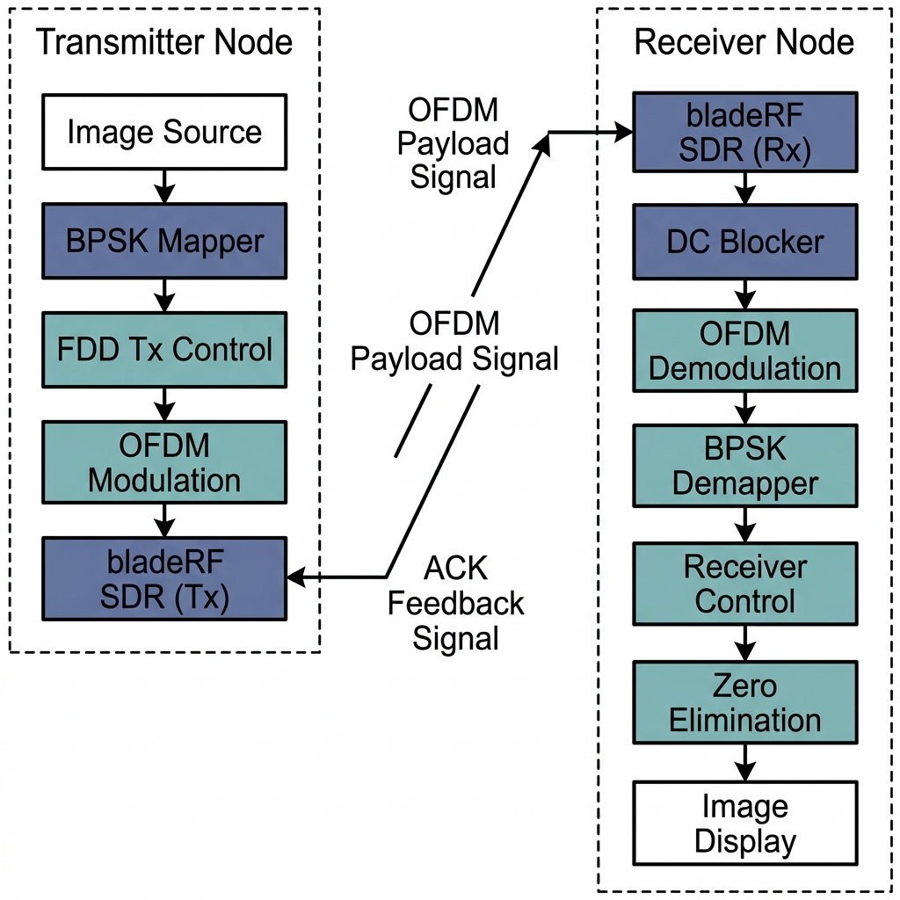
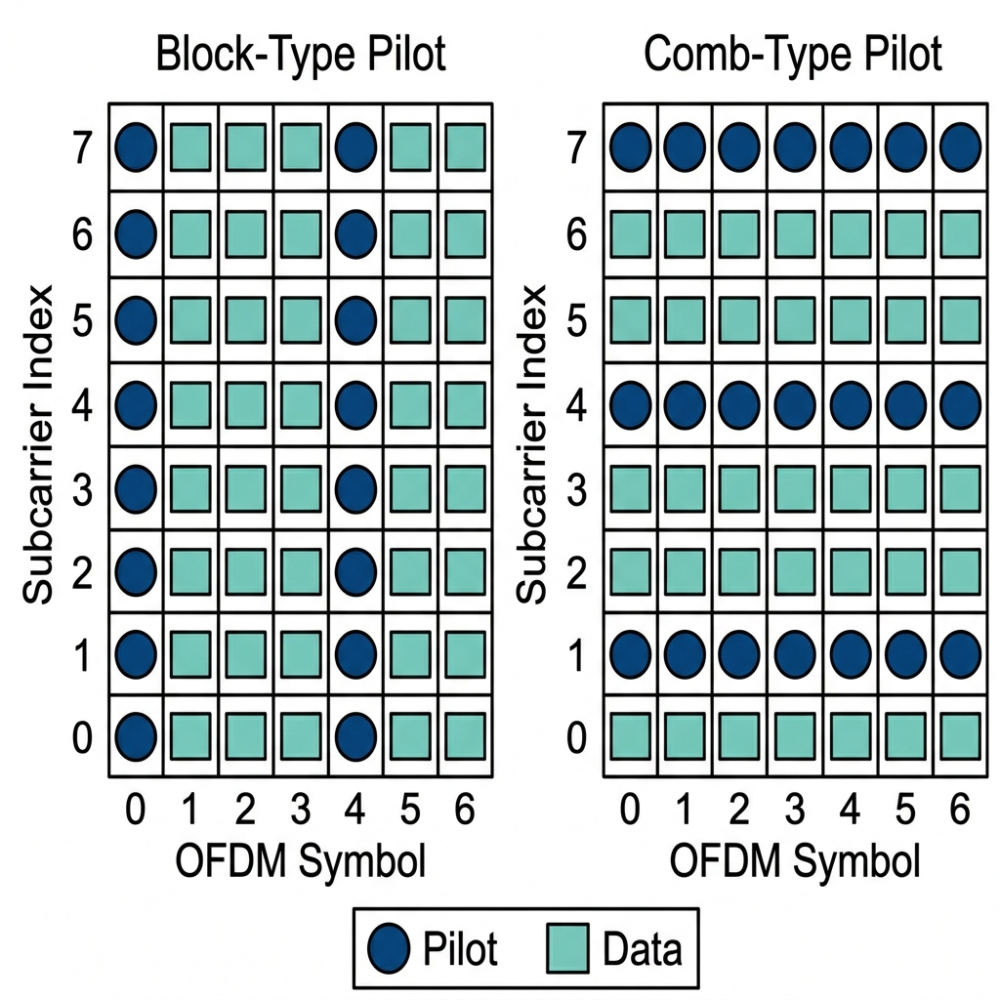

# gr-ofdm_testbed: OFDM Transceiver Testbed OOT Module

<p align="center">
  
  
  
  
</p>

`gr-ofdm_testbed` is an out-of-tree (OOT) digital signal processing module for GNU Radio 3.10 designed to prototype, simulate, and deploy Orthogonal Frequency Division Multiplexing (OFDM) physical layers. The module facilitates testing channel estimation methods, frame synchronization, and closed-loop Frequency Division Duplexing (FDD) flow control both in simulation and over-the-air using Software Defined Radios (SDRs).

---

## 📌 Table of Contents
1. [System Architecture](#system-architecture)
2. [Pilot Configurations](#pilot-configurations)
3. [Features](#features)
4. [Examples](#examples)
5. [Build & Compilation](#build-compilation)
6. [Contributors](#contributions)

---

## <a id="system-architecture"></a>📡 System Architecture

The signal processing pipelines of the transmitter (Tx) and receiver (Rx) are illustrated below. This block diagram outlines the flow from payload vectorization, baseband mapping, OFDM modulation, RF transmission, baseband demodulation, and the reverse feedback path:

<p align="center">
  
  <br>
  <em>Figure 1: Full-duplex closed-loop OFDM baseband transceiver schematic with bladeRF SDR interface.</em>
</p>

---

## <a id="pilot-configurations"></a>🧬 Pilot Configurations

The transceiver design is based on the logic from the **[SDR_NC](https://github.com/DoHaiSon/SDR_NC)** repository.

### Pilot Pattern Evolution
* **Original System (`gr-s4a`):** In the parent project's [gr-s4a](https://github.com/DoHaiSon/SDR_NC/tree/master/Software/GnuRadio_Block_NC/gr-s4a) module, the OFDM grid employed **block-type pilot distribution**. Pilots were assigned to all subcarriers within specific OFDM symbols periodically in time. This arrangement is highly efficient for slow-fading, frequency-flat channels where the channel frequency response remains stationary over multiple symbol intervals.
* **Modernized System (`gr-ofdm_testbed`):** To support fast-fading and frequency-selective channels, this module has been redesigned for **GNU Radio 3.10** to employ **comb-type pilot distribution**. Pilots are allocated to dedicated subcarriers across every OFDM symbol. This configuration permits continuous, symbol-by-symbol channel estimation and interpolation, tracking rapid temporal fluctuations of the propagation channel.

Below is a comparison highlighting the grid differences between the block-type and comb-type pilot layouts:

<p align="center">
  
  <br>
  <em>Figure 2: Subcarrier grid allocation representing block-type vs. comb-type pilot placement.</em>
</p>

---

## <a id="features"></a>⚙️ Features

### 1. Verification Environments
The module provides testbeds for two distinct deployment levels:
* **Software-Defined Simulation:** Integrates simulated channel models (e.g., AWGN, phase noise, and multipath fading profiles) to evaluate Bit Error Rate (BER) floors and synchronization performance.
* **Hardware-in-the-Loop (HIL) Deployment:** Targets physical **bladeRF SDRs** for over-the-air transmission to evaluate RF performance, transceiver impairments, and real-world synchronization accuracy.

### 2. Physical Layer Payload Scenarios
* **Vectorized Image Streaming:** The module includes source blocks (`image_vector_source`) designed to read standard test images (e.g., `lena_gray_512.txt`), convert them into segmented byte payloads of length `packet_size`, and stream them. The receiver incorporates a matching `zero_elimination` block to strip padding zeros and preserve the payload boundaries.
* **Text / Byte Array Exchange:** Provides basic vector-to-stream conversions to facilitate file transfers.

### 3. Closed-Loop FDD Flow Control
* Implements a closed-loop link layer. The `primary_tx_control` block at the transmitter schedules payload frames dynamically based on the state of acknowledgment (ACK) vectors returned via the reverse FDD feedback link by the receiver's `receiver_control_p2p` block.

---

## <a id="examples"></a>📁 Examples

All experimental setups are located under the `examples/` directory:

| Flowgraph | Target Environment | Description |
| :--- | :--- | :--- |
| **`ofdmber.grc`** | Simulation | Evaluates baseband Bit Error Rate (BER) curves against varying Eb/N0 levels. |
| **`ofdm.grc` / `ofdm.py`** | Simulation | Base template of the standard GNU Radio OFDM transmitter and receiver pipeline. |
| **`test_BER.grc`** | Simulation | Verification tool for the accuracy of custom BER calculation blocks. |
| **`p2p.grc` / `p2p.py`** | HIL (bladeRF) | Unified Point-to-Point transceiver setup with real-time image rendering at the receiver. |
| **`p2p_tx.grc` / `p2p_RX.grc`** | HIL (bladeRF) | Decoupled transmitter and receiver flowgraphs for deployment on separate SDR nodes. |
| **`ofdm_loopback_blade09Tx/Rx`**| HIL (bladeRF) | Transceiver loopbacks configured for targeted RF channels. |

---

## <a id="build-compilation"></a>🛠️ Build & Compilation

### System Dependencies
* GNU Radio (version 3.10 or newer)
* CMake (version 3.8 or newer)
* Host compiler with C++17 support (GCC >= 8)

### Installation Command Sequence
```bash
# Create build directory
mkdir build
cd build

# Generate build files and compile
cmake ..
make -j$(nproc)

# Install OOT library modules
sudo make install
sudo ldconfig
```

---

## <a id="contributions"></a>📋 Contributors

<table width="100%">
  <tr>
    <td width="30%"><strong>Module Title</strong></td>
    <td>gr-ofdm_testbed</td>
  </tr>
  <tr>
    <td><strong>Supported GNU Radio</strong></td>
    <td>3.10</td>
  </tr>
  <tr>
    <td><strong>License</strong></td>
    <td>GPL-3.0</td>
  </tr>
  <tr>
    <td><strong>Repository URL</strong></td>
    <td><a href="https://github.com/DoHaiSon/gr-ofdm_testbed">DoHaiSon/gr-ofdm_testbed</a></td>
  </tr>
  <tr>
    <td><strong>Project Owner</strong></td>
    <td><a href="https://dohaison.github.io/">Do Hai Son</a></td>
  </tr>
  <tr>
    <td><strong>Contributors</strong></td>
    <td>
      <ul>
        <li><a href="https://github.com/minhdm05">Minh DM</a></li>
        <li><a href="https://github.com/haiminh-bla">Hai Minh</a></li>
      </ul>
    </td>
  </tr>
</table>
